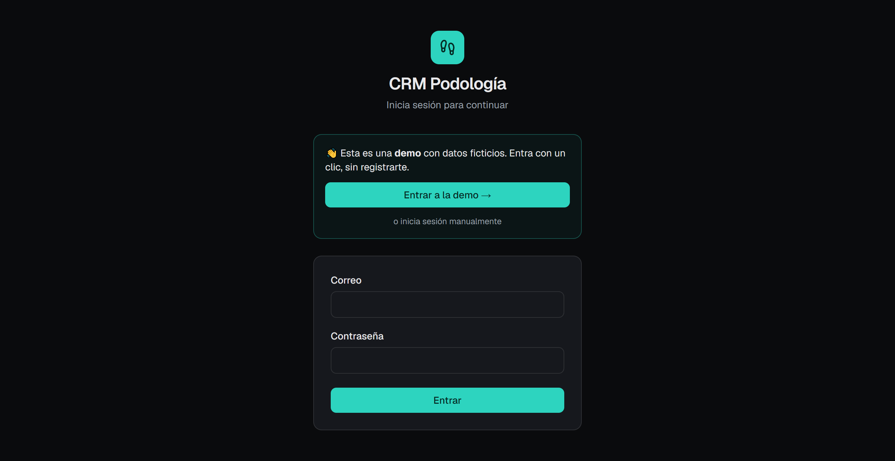
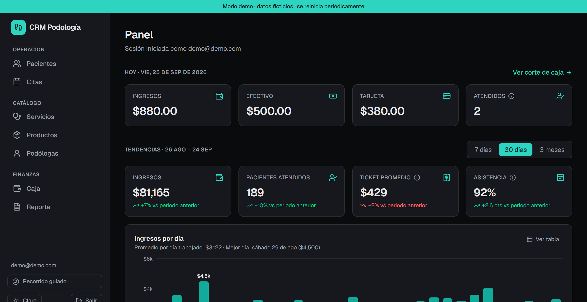
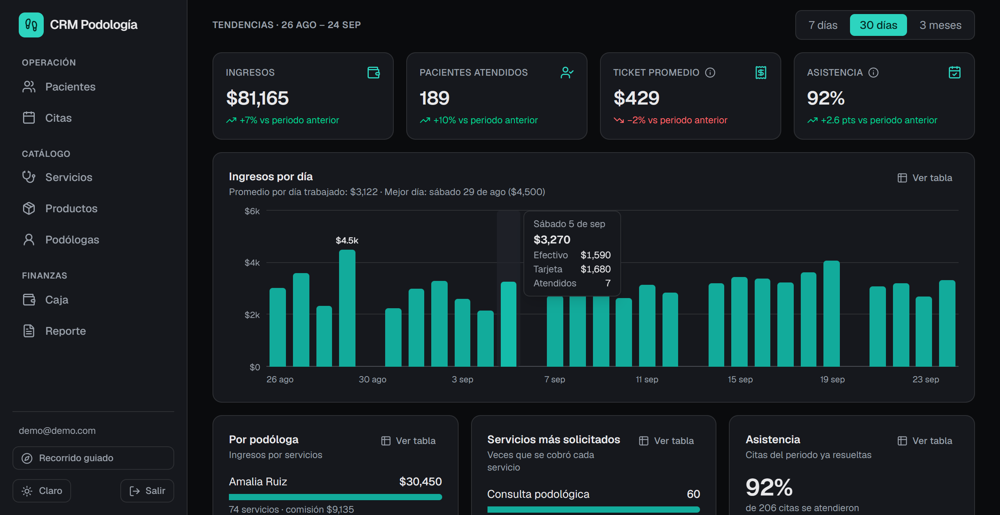
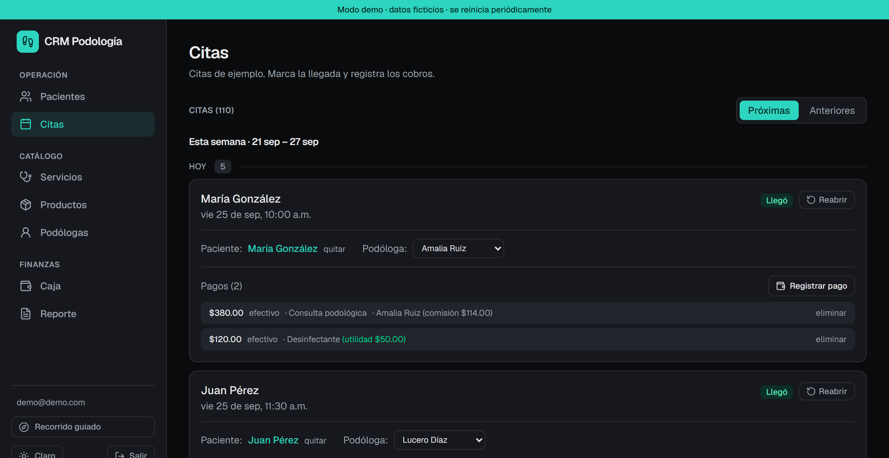
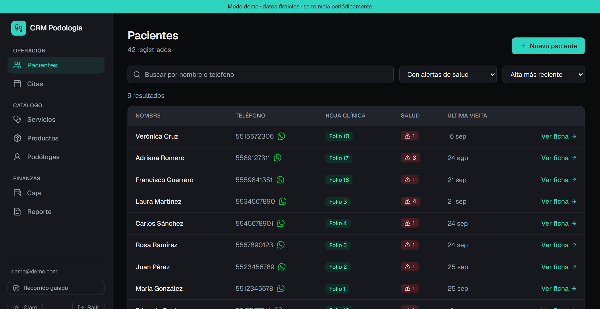
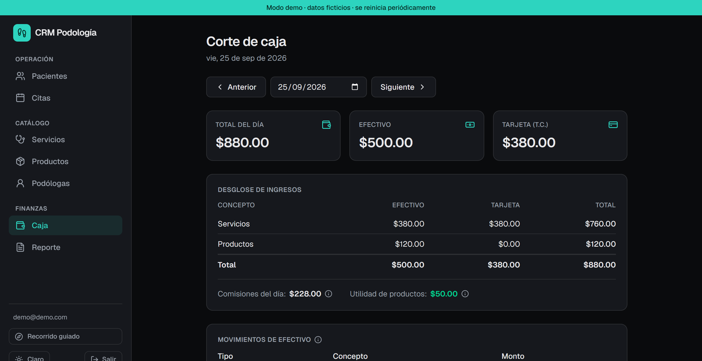
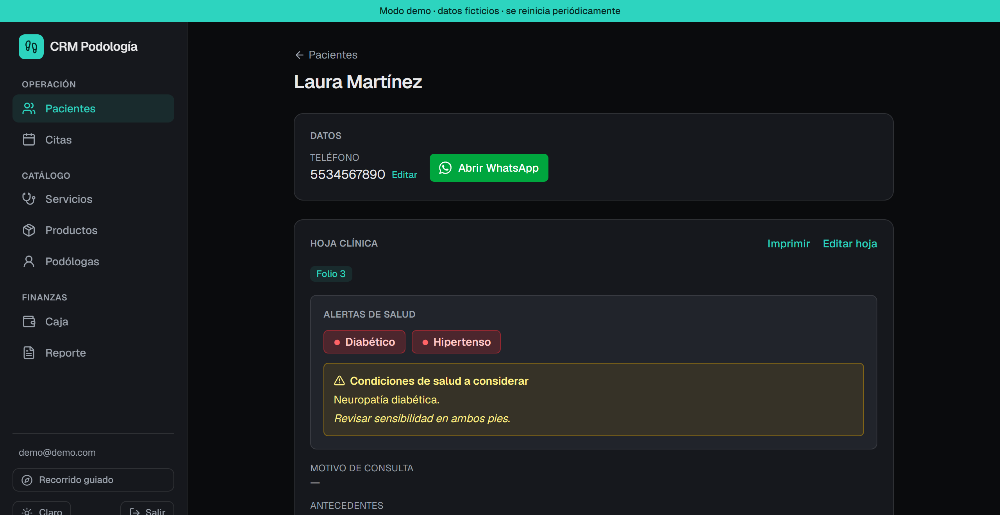

# CRM para una clínica de podología

> Un sistema de gestión a medida que reemplazó hojas de Excel y expedientes de
> papel por un flujo digital: pacientes, citas, cobros, comisiones e inventario.

**🔗 [Probar la demo en vivo](https://podocrm-sandy.vercel.app/)** — un clic en *"Entrar a
la demo"* y estás dentro, con datos ficticios.

**Rol:** Desarrollo full-stack (producto, diseño y código).
**Duración:** ~2 semanas · **Estado:** en producción para el cliente + demo pública.

---

## El reto

El dueño de una clínica de podología gestionaba todo de forma manual: los datos
de sus clientes en notas de Excel y las hojas clínicas en expedientes físicos
dentro de un archivero. Esto hacía lento consultar el historial de un paciente,
imposible sacar reportes (como el que exige la Secretaría de Salud) y propenso a
errores el cálculo de las comisiones de sus podólogas.

Necesitaba **una sola herramienta** que ordenara su operación diaria sin cambiar
la forma en que ya trabajaba (por ejemplo, sigue agendando en Google Calendar y
sus clientes la contactan por WhatsApp).

## La solución

Un CRM web hecho a la medida del negocio, que cubre todo el ciclo:

- **Pacientes con hoja clínica digital** — una ficha por paciente con su hoja
  clínica única (folio, banderas médicas, alergias) e impresión en PDF cuando se
  necesita en papel.
- **Agenda conectada a Google Calendar** — las citas se importan del calendario
  que el dueño ya usa (solo lectura, sin tocar su flujo), agrupadas por semana y
  día, con marcado de asistencia.
- **Cobros, comisiones e inventario** — cada cita registra su pago (efectivo o
  tarjeta); la comisión de la podóloga se calcula sola; los productos de venta
  descuentan stock y registran utilidad.
- **Corte de caja y reportes** — totales del día por método de pago, efectivo
  esperado en caja y el reporte de pacientes atendidos listo para imprimir.
- **Panel con análisis del negocio** — ingresos, pacientes atendidos, ticket
  promedio y asistencia comparados con el periodo anterior, además de ingresos
  por podóloga y servicios más solicitados.
- **Búsqueda de pacientes** por nombre o teléfono (sin importar acentos), con
  filtros de salud y orden por última visita.

## Decisiones técnicas destacadas

- **El calendario como fuente de verdad.** En vez de obligar al dueño a agendar
  en el CRM, el sistema *lee* su Google Calendar (nunca escribe). El emparejado
  cita↔paciente auto-liga solo coincidencias exactas y ofrece sugerencias por
  parecido + un buscador, pensado para escalar a miles de clientes.
- **Modelo de comisiones fiel al negocio.** Analicé el Excel real del dueño para
  descubrir que la comisión es un **porcentaje fijo por podóloga** (no por
  servicio) y que el reporte separa comisión en efectivo vs. tarjeta. El sistema
  replica exactamente esa lógica.
- **Fechas en zona horaria fija de México.** Los cortes de caja y el agrupado de
  citas se calculan siempre en `America/Mexico_City`, para que un cobro de las
  8 p.m. caiga en el día correcto sin importar dónde corra el servidor.
- **Arquitectura moderna y sobria.** Next.js con Server Components y Server
  Actions: la lógica vive en el servidor y el cliente solo carga interactividad
  puntual. Un sistema de diseño propio (tokens, tema claro/oscuro, componentes
  reutilizables) mantiene la interfaz consistente y ligera.
- **Una demo pública sin exponer datos reales.** Misma base de código, pero con
  base de datos y despliegue **separados**: la versión de portafolio usa datos
  ficticios, login de invitado y un reseteo diario automático. Los datos simulan
  seis meses de operación (generados de forma determinista) para que las
  gráficas cuenten una historia, y un recorrido guiado explica el producto a
  quien lo abre por primera vez.
- **Gráficas propias, accesibles y ligeras.** Hechas con HTML/CSS (sin librería
  de gráficas), con colores validados contra daltonismo en ambos temas, tooltip
  con teclado y una vista en tabla de cada gráfica.

## Resultado

- Consulta del historial de un paciente en segundos (antes: buscar en el
  archivero).
- Comisiones calculadas automáticamente y desglosadas por método de pago.
- Reporte para la Secretaría de Salud en un clic.
- Corte de caja diario que cuadra el efectivo esperado.
- Visión del negocio de un vistazo: tendencias de ingresos y asistencia.
- Una demo en vivo que cualquiera puede probar sin registrarse, con recorrido
  guiado.

## Stack

`Next.js 16` · `React 19` · `TypeScript` · `Tailwind CSS 4` · `Prisma` ·
`PostgreSQL (Supabase)` · `Supabase Auth` · `Google Calendar API` · `driver.js` ·
`Vercel`

---

## Capturas

| | |
|---|---|
| Login / acceso a demo |  |
| Panel del día |  |
| Tendencias del negocio |  |
| Citas agrupadas por semana |  |
| Pacientes con buscador y filtros |  |
| Corte de caja |  |
| Ficha del paciente |  |
